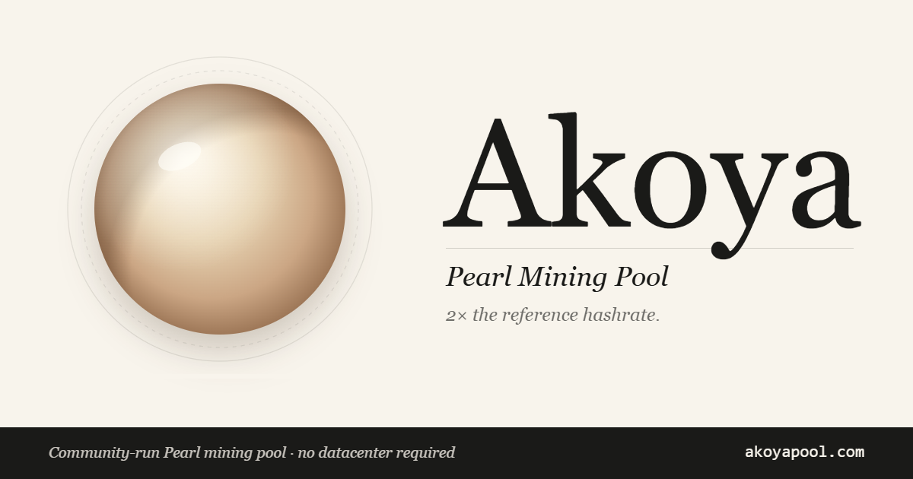

<p align="center">
  
</p>

# ARC-miner

**An open-source, 0%-fee GPU miner for Pearl (PRL) — tuned for Intel Arc, with
NVIDIA and AMD support.**

ARC-miner mines **Pearl (PRL)** on any compatible pool. Its proof of work is a
low-rank-noised integer GEMM (matrix-multiply): each candidate is a tile of
`A · Bᵀ` that is hashed and checked against a difficulty target. The heavy
compute runs on the GPU — **Intel Arc (SYCL/XMX)**, **NVIDIA (CUDA)**, or
**AMD (ROCm)** — while the host handles the pool connection, BLAKE3 keyed-merkle
commitments, and share submission.

It started as an Intel-Arc port of the Akoya reference miner and grew into a
production miner with per-die AOT kernels, an adaptive autotuner, a low-overhead
host loop, and broad pool compatibility. **It takes no developer fee — 0%,
forever.**

- **License:** GNU GPL-3.0 (see [`LICENSE`](LICENSE))
- **Protocol:** Stratum (`pearl/v1` challenge-first + plain client-first) and gRPC/V2 ([`proto/v2/miner.proto`](proto/v2/miner.proto))
- **Platforms:** Windows 10/11 x64, Linux x64/ARM64

---

## Highlights

- **0% dev fee.** No fee, no dev-mining, no telemetry.
- **Intel Arc first-class.** Dual XMX kernels (Xe-HPG `sg8` / Xe2 `sg16`) with
  runtime dispatch; per-die AOT builds for top speed, or a universal JIT build.
- **Adaptive autotune.** `arc-miner autotune` sweeps the kernel knobs for your
  card and caches the optimum — paste wallet, run, mine optimally.
- **Low-CPU host loop.** Sleeps the host through the GPU batch instead of
  busy-polling (≈0.3% of one core while mining at full speed).
- **Broad pool support.** Speaks both stratum dialects and gRPC/V2; works with
  most Pearl pools (see [`docs/POOLS.md`](docs/POOLS.md)).
- **Stats API.** Optional JSON (`/api/stats`) and Prometheus (`/metrics`)
  endpoints for dashboards (`--api-port <p>`).
- **Self-contained.** Native AOT — no .NET runtime required to run the binary.

### Measured performance (full power)

| GPU | Build | Hashrate |
|---|---|---|
| Arc **B580** | AOT `bmg-g21` | ~**34.8 TH/s** |
| Arc **A750** | AOT `acm-g10` | ~**3.8 TH/s** |

Numbers are very power-sensitive — confirm 100% GPU power before comparing.

---

## Supported GPUs

The build auto-detects your card and selects the matching kernel — override with
`PEARL_GEMM_ARCH=…` (CUDA) or `SYCL_ARCH=…` (Intel) if needed.

| Architecture | Example GPUs | Backend / arch |
|---|---|---|
| **Intel Arc (Battlemage)** | B580, B570, B770 | `sycl` · `bmg-g21` |
| **Intel Arc (Battlemage, big)** | Arc Pro B70 | `sycl` · `bmg-g31` |
| **Intel Arc (Alchemist)** | A770, A750, A580, A380 | `sycl` · `acm-g10` / `acm-g11` |
| **NVIDIA Blackwell** | RTX 50-series (5090 / 5080 …) | `cuda` · `blackwell` |
| **NVIDIA Blackwell (DC)** | B200 | `cuda` · `b200` |
| **NVIDIA Hopper** | H100, H200 | `cuda` · `h100` |
| **NVIDIA Ada** | RTX 40-series, L4, L40S, RTX 6000 Ada | `cuda` · `ada` |
| **NVIDIA Ampere** | RTX 30-series, A100, A40, A6000 | `cuda` · `ampere` |
| **NVIDIA Turing / Volta** | RTX 20-series, T4 / V100 | `cuda` · `turing` / `volta` |
| **AMD CDNA3** | MI300X | `rocm` |

Other NVIDIA cards (sm_70+) build with the `portable` fallback.

---

## Quick start (Intel Arc, Windows — prebuilt)

If you're using a prebuilt release, you only need the **Intel Arc GPU driver** —
no oneAPI, no .NET runtime.

1. Install the latest [Intel Arc driver](https://www.intel.com/content/www/us/en/download/785597/).
2. Extract the release zip anywhere (e.g. `C:\arc-miner`).
3. Open a terminal in that folder and run:

```powershell
.\arc-miner.exe --pool stratum+tls://ca.pearl.herominers.com:1200 --wallet prl1yourwallet --worker rig01
```

Within a minute you should see the GPU detected, a short benchmark, `✓ connected
& authorized`, then periodic `worker[0] hashrate=…` lines. See
[`docs/POOLS.md`](docs/POOLS.md) for more pools and [`MINING-GUIDE.md`](MINING-GUIDE.md)
for the full Windows user guide.

> **Auto-tunes itself on first run.** The first time you mine on a given card,
> ARC-miner runs a one-time autotune sweep, caches the best kernel config, and
> mines with it (every later launch just loads the cache). This matters most on
> **A-series** cards, which are ~25× slower at the default window. Skip it with
> `--no-autotune`, or re-tune anytime with `arc-miner.exe autotune`.

---

## Build from source

The build runs on **Linux (x64/ARM64)** via `./build.sh` and **natively on
Windows** via `.\build.ps1` (no WSL required). It compiles the native kernels +
the BLAKE3 merkle library, publishes the host with **Native AOT**, and assembles
a self-contained **`./out`** folder.

### Prerequisites

Both build scripts check for these at startup and list anything missing.

- **.NET 10 SDK** (Linux AOT also needs **`clang`** + **`zlib1g-dev`**)
- **Rust** toolchain (`cargo`)
- **git** (CUTLASS is a submodule, CUDA only) and **`make`**
- A GPU toolchain for your backend:
  - **Intel Arc:** Intel **oneAPI Base Toolkit** (`icpx` / DPC++) + the Arc GPU driver.
  - **NVIDIA:** CUDA Toolkit **12.4+** (`nvcc`; 12.8 for sm_90+), `python3`, driver, sm_70+ GPU.
  - **AMD:** ROCm / HIP (`hipcc`) + a CDNA3 GPU.
- **Windows:** Visual Studio (Community) with **"Desktop development with C++"**
  (provides the AOT linker, CMake, Ninja) — replaces `clang`/`make` on Linux.

### Intel Arc

**Windows:**
```powershell
. "C:\Program Files (x86)\Intel\oneAPI\setvars.ps1"
.\build.ps1 -Backend sycl                         # JIT — runs on any Arc GPU
.\build.ps1 -Backend sycl -SyclArch bmg-g21       # AOT — B580/B570 (fastest)
.\build.ps1 -Backend sycl -SyclArch acm-g10       # AOT — A770/A750/A580
```
For a fully set-up AOT link environment on oneAPI 2026.0, `build-aot.ps1 <arch> <out>`
wraps `build.ps1` with vcvars + oneAPI libs.

**Linux:**
```bash
. /opt/intel/oneapi/setvars.sh
BACKEND=sycl ./build.sh                                  # JIT
BACKEND=sycl SYCL_ARCH=bmg-g21 ./build.sh                # AOT — B580
BACKEND=sycl SYCL_ARCH=acm-g10 ./build.sh                # AOT — A750/A770
```
Add your user to the `render`/`video` groups (`sudo usermod -aG render,video $USER`, re-login).

> **AOT builds are strictly per-die.** An `acm-g10` build runs only on Alchemist,
> `bmg-g21` only on B580/B570, `bmg-g31` only on B70 — they crash on the wrong
> family (the miner guards against this and exits with a clear message). The
> universal **JIT** build runs on any Intel GPU at ~5% lower speed; prefer it for
> a "download & run" setup and AOT for known-card rigs.

### NVIDIA (CUDA)

```bash
./build.sh                          # auto-detects arch (override: PEARL_GEMM_ARCH=ada)
```
```powershell
.\build.ps1                         # auto-detects (override: -Arch ada)
```

### AMD (ROCm)

```bash
BACKEND=rocm ./build.sh
```

### Building manually

`build.sh` runs three steps you can also run individually:

```bash
# 1. PoW kernels → libpearl_gemm_capi.so
git submodule update --init --depth 1 native/pearl-gemm/third_party/cutlass   # CUDA only
make -C native/pearl-gemm/csrc/capi PEARL_GEMM_ARCH=ada       # NVIDIA
#  Intel: see build.sh BACKEND=sycl path / native/pearl-gemm/csrc/sycl/Makefile
#  AMD:   make -C native/pearl-gemm/csrc/rocm/host

# 2. BLAKE3 merkle C ABI → libpearl_mining_capi.so
cargo build --release --manifest-path native/Cargo.toml

# 3. host (Native AOT, self-contained) → ./out
dotnet publish src/Akoya.Miner/Akoya.Miner.csproj -c Release -r linux-x64 \
  --self-contained true -p:PublishAot=true -o out
```

### Verify the build

```bash
arc-miner selftest          # checks config + native libs + pool reachability; exit 0 = ready
arc-miner version           # prints version + git sha
```

### Build options

| Variable | Values | Default |
|---|---|---|
| `BACKEND` | `cuda`, `rocm`, `sycl` | `cuda` |
| `PEARL_GEMM_ARCH` | `h100`, `ampere`, `ada`, `blackwell`, `b200`, `volta`, `turing`, `portable` | auto-detect — CUDA only |
| `SYCL_ARCH` | `acm-g10`, `acm-g11`, `bmg-g21`, `bmg-g31` | empty = JIT — SYCL only |
| `CONFIG` | `Release`, `Debug` | `Release` |
| `RID` | .NET runtime identifier | `linux-x64` |
| `OUT` | output folder | `./out` |

(Detailed per-platform setup — WSL2, ARM64/Jetson, driver links — is preserved in
[`docs/`](docs/) and the build-script headers.)

---

## Running & configuration

### Command-line options

| Option | Meaning |
|---|---|
| `--pool <host:port>` | Pool address. Schemes: `stratum+tcp://`, `stratum+ssl://`, `tcp://`, `ssl://` |
| `--wallet`, `-w` | Pearl payout address (`prl1…`) — **required** |
| `--worker`, `-n` | Worker name (default: machine name) |
| `--tls` / `--no-tls` | Force TLS on/off |
| `--diff <n>` | Request a fixed share difficulty (pools honouring `d=`) |
| `--password`, `-p` | Stratum password, e.g. `x;d=250000` |
| `--keepalive [sec]` | Application-layer keepalive for pools that drop idle connections |
| `--api-port <p>` | Enable the local stats API (JSON `/api/stats`, Prometheus `/metrics`) |
| `--mpp <n>` / `--budget <ms>` | Pipelining / benchmark tuning overrides |

Subcommands: `mine-blocks` (default), `autotune`, `selftest`, `version`.

### Useful environment variables

| Variable | Meaning |
|---|---|
| `AKOYA_MINE_TRIGGER_WATCHDOG_SEC` / `_K` | No-trigger watchdog floor (s) and adaptive multiple (`K`, default 20; `0`=fixed) |
| `AKOYA_METRICS_PORT` | Stats API port (same as `--api-port`) |
| `AKOYA_GPU_INDICES` | `all` or comma-separated device indices |
| `AKOYA_LOG_LEVEL` | Log verbosity |
| `AKOYA_PEARL_GEMM_LIB` / `AKOYA_PEARL_MINING_LIB` | Override native library paths |

See [`docs/POOLS.md`](docs/POOLS.md) for connecting to specific pools and
[`MINING-GUIDE.md`](MINING-GUIDE.md) for the full Windows walkthrough.

---

## How it works

At runtime the host loads two native libraries via P/Invoke:
`pearl_gemm_capi` (the GPU kernels) and `pearl_mining_capi` (the BLAKE3 merkle).
The host runs the pool session (stratum/gRPC), drives the GPU search loop, builds
keyed-merkle commitments for winning tiles, and submits shares. The PoW target
comparison and the kernel's int7×int7→int32 XMX/DP4A math are described in the
kernel sources under [`native/pearl-gemm/csrc/`](native/pearl-gemm/csrc/).

### Project layout

```
arc-miner/
├── build.sh / build.ps1 / build-aot.ps1   # builds → ./out (self-contained)
├── Akoya.slnx                              # .NET solution
├── proto/v2/miner.proto                    # gRPC wire protocol
├── src/                                    # C# host
│   ├── Akoya.Miner/                        #   entry point, mining loop, autotune, metrics
│   ├── Akoya.Pool/                         #   stratum + gRPC session
│   ├── Akoya.Crypto / .Mining / .MinerCore #   BLAKE3 / noise / merkle / jackpot
│   └── Akoya.Cuda / .PearlGemm / .Proto    #   native P/Invoke + gRPC stubs
├── native/
│   ├── pearl-gemm/csrc/                     # PoW GEMM kernels: sycl/ (Intel), gemm/ (CUDA),
│   │   │                                    #   rocm/, portable/, tensor_hash/, blake3/, capi/
│   │   └── third_party/cutlass              # NVIDIA CUTLASS (submodule, BSD-3)
│   ├── pearl-blake3/                         # BLAKE3 keyed-merkle (Rust)
│   └── pearl-mining-capi/                    # C ABI over pearl-blake3 (Rust)
└── docs/                                    # protocol, pools, fee-transparency RFC, fork notes
```

---

## Pearl MoE hard fork

Pearl is hard-forking the proof of work to add **Mixture-of-Experts** models. Per
the upstream upgrade guide, **dense miners like this one keep working before and
after the fork with no changes** — the V2 certificate accepts dense proofs, and
the node/pool side handles the certificate upgrade. Mining MoE models is optional.
See [`docs/MOE-PORT-PLAN.md`](docs/MOE-PORT-PLAN.md) for the assessment and an
optional MoE port plan.

---

## Contributing

Issues and pull requests welcome. ARC-miner is GPL-3.0 — contributions are
accepted under the same license. See [`CONTRIBUTING.md`](CONTRIBUTING.md).

There is also a draft RFC for standardized, machine-readable pool fee disclosure
([`docs/POOL-FEE-TRANSPARENCY.md`](docs/POOL-FEE-TRANSPARENCY.md)) — pool operators
and miner authors are invited to comment.

---

## License & attribution

ARC-miner is licensed under the **GNU General Public License v3.0** — see
[`LICENSE`](LICENSE). You may use, study, modify, and redistribute it; derivative
works must remain GPL-3.0.

- Originated as an Intel-Arc port of the **Akoya reference miner** for Pearl.
- `native/pearl-gemm/third_party/cutlass` is **NVIDIA CUTLASS** (BSD-3-Clause),
  included as a submodule under its own license.

**0% dev fee, forever.**
