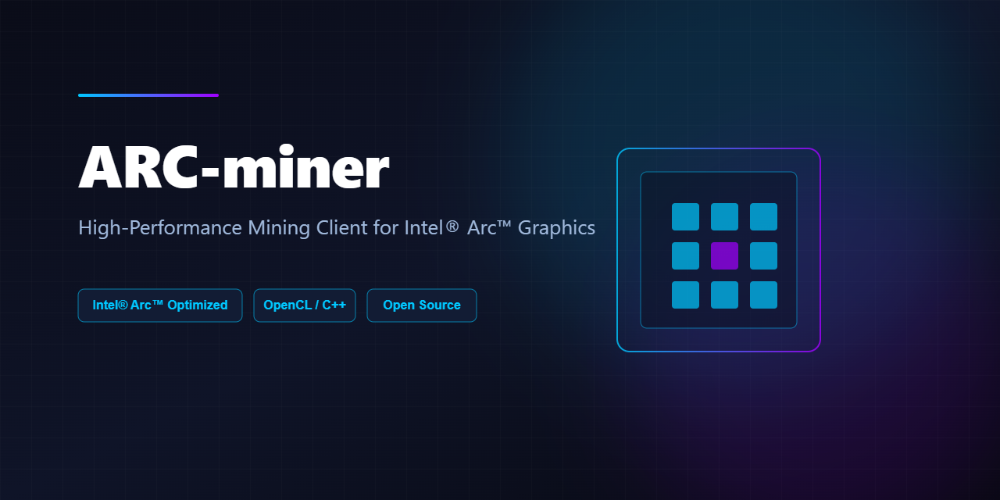

<p align="center">
  
</p>

# ARC-miner

**An open-source, 0%-fee multi-algo miner built for Intel Arc.**

ARC-miner mines six algorithms across three GPU coins and three CPU coins, and
can mine one of each at the same time. The GPU side is **Intel Arc only** —
SYCL/DPC++ with hand-written XMX (DPAS) kernels, dual sub-group variants for
Alchemist and Battlemage, per-die AOT builds, and an adaptive autotuner. The CPU
side wraps XMRig's own hashing cores through a thin C ABI, so CPU hashrate is at
parity with XMRig rather than a reimplementation of it.

**It takes no developer fee — 0%, forever.** No fee, no dev-mining, no telemetry.

- **License:** GNU GPL-3.0 (see [`LICENSE`](LICENSE))
- **Platforms:** Windows 10/11 x64, Linux x64 (HiveOS supported natively)
- **GPU:** Intel Arc A-series (Alchemist) and B-series (Battlemage). No NVIDIA, no AMD.

---

## Algorithms

| `--algo` | Coin | Device | Connection |
|---|---|---|---|
| `prl` | **Pearl (PRL)** — low-rank-noised int8 GEMM | GPU | Stratum (`pearl/v1` challenge-first + plain) and gRPC/V2 |
| `csd` | **Compute Substrate (CSD)** — sha256d | GPU | Pool, canonical Bitcoin Stratum V1 |
| `rx` | **Monero (XMR)** and other RandomX coins | CPU | Pool stratum, or solo against a `monerod` node |
| `gr` | **Raptoreum (RTM)** — GhostRider | CPU | Pool stratum, or solo against `raptoreumd` |
| `nm` | **Cereblix (CRB)** — NeuroMorph | CPU | Pool stratum |

`--algo` is case-insensitive and defaults to `prl`.

### Dual mining

Pair any GPU algo with any CPU algo using `<gpu>+<cpu>` — nine combinations, all
verified on real hardware:

```powershell
arc-miner.exe --algo prl+rx --pool stratum+tls://ca.pearl.herominers.com:1200 --wallet prl1yourwallet ^
              --pool-cpu stratum+tls://xmr.pool.example:443 --wallet-cpu 4YourMoneroAddress
```

The two halves mine **different coins on different pools**, so they take separate
connection settings: `--pool`/`--wallet`/`--worker`/`--password` stay with the GPU
algo, and `--pool-cpu`/`--wallet-cpu`/`--worker-cpu`/`--password-cpu` configure the
CPU one. (`--cpu-pool` and `--cpu-wallet` are accepted as aliases.)

When dual-mining, the CPU algo automatically reserves two logical CPUs for the GPU
host loop — without that it saturates every core and the GPU starves. Override with
`--threads-cpu <n>`.

---

## Supported GPUs

| Die | Example GPUs | AOT target |
|---|---|---|
| **Battlemage** | Arc B580, B570 | `intel_gpu_bmg_g21` |
| **Battlemage (large)** | Arc B770 | `intel_gpu_bmg_g31` |
| **Alchemist** | Arc A770, A750 | `intel_gpu_acm_g10` |
| **Alchemist (small)** | Arc A580, A380, A310 | `intel_gpu_acm_g11` |
| **Alchemist (mobile)** | Arc A370M, A350M | `intel_gpu_acm_g12` |

A **JIT** build (the default) runs on any of these with no target selected. AOT
builds are **strictly per-die** — an `acm_g10` build will not run on Battlemage and
vice versa; the miner detects the mismatch and exits with a clear message. See
[Build from source](#build-from-source) for when to prefer which.

Integrated GPUs are skipped by default as too slow; `--igpu` allows them.

### Measured performance

| GPU | Algo | Hashrate |
|---|---|---|
| Arc **B580** | `prl` | ~**35 TH/s** per card |
| Arc **A750** | `prl` | ~**3.8 TH/s** |
| Ryzen 9 5900X (24t) | `rx` | ~**12.5 KH/s** |
| Ryzen 9 5900X (24t) | `gr` | ~**2.2 KH/s** |
| Ryzen 9 5900X (24t) | `nm` | ~**11.1 KH/s** |

The B580 figure is from a 2× B580 Linux rig at stock clocks on a JIT build.
Hashrate is very power- and clock-sensitive — confirm 100% GPU power before
comparing numbers with anyone.

---

## Quick start — Windows, prebuilt

You only need the **Intel Arc GPU driver**. No oneAPI, no .NET runtime — the
binary is self-contained Native AOT.

1. Install the latest [Intel Arc driver](https://www.intel.com/content/www/us/en/download/785597/).
2. Extract the release zip anywhere, e.g. `C:\arc-miner`.
3. Open a terminal there and run:

```powershell
.\arc-miner.exe --algo prl --pool stratum+tls://ca.pearl.herominers.com:1200 --wallet prl1yourwallet --worker rig01
```

Within a minute you should see the GPU detected, a short benchmark, `connected &
authorized`, then the live dashboard. See [`docs/POOLS.md`](docs/POOLS.md) for more
pools and [`docs/MINING-GUIDE.md`](docs/MINING-GUIDE.md) for the full Windows guide.

> **It auto-tunes itself on first run.** The first time you mine on a given card,
> ARC-miner sweeps the kernel knobs, caches the best config, and mines with it;
> every later launch just loads the cache. This matters most on **A-series** cards,
> which are dramatically slower at the default window. Skip with `--no-autotune`,
> or re-tune any time with `arc-miner.exe autotune`.

## Quick start — Linux

The release tarball is self-contained: it ships the Intel oneAPI runtime beside
the binary, so it runs on a clean box with no oneAPI installed.

```bash
tar xzf arc-miner-<ver>.tar.gz && cd arc-miner
LD_LIBRARY_PATH=$PWD ./arc-miner --algo prl --pool stratum+tls://host:port --wallet prl1yourwallet
```

Mining needs access to the GPU render nodes. Either run as root, or add yourself to
the right groups and log back in:

```bash
sudo usermod -aG render,video $USER
```

> If Level Zero reports `zeInit -> 0x78000001` while OpenCL "works", that is almost
> always **render-group permissions**, not a missing Level Zero package.

### HiveOS

There is a first-class HiveOS integration under [`hive/`](hive/) — flight-sheet
config, stats scraping to the dashboard, ReBAR preflight, and optional clock/power
limits. Build the package with `./hive/package.sh` and see
[`hive/README.md`](hive/README.md).

---

## Build from source

Builds natively on **Windows** via `.\build.ps1` (no WSL needed) and on **Linux**
via `./build.sh`. Both compile the SYCL kernels and the Rust BLAKE3 merkle library,
publish the host with Native AOT, and assemble a self-contained `./out` folder.

### Prerequisites

Both scripts check these at startup and list anything missing.

- **.NET 10 SDK**
- **Rust** toolchain (`cargo`)
- **Intel oneAPI Base Toolkit** (`icpx` / DPC++) and an Arc GPU driver
- **Linux:** `clang`, `zlib1g-dev`, `make`, `python3`
- **Windows:** Visual Studio with **"Desktop development with C++"** (provides the
  Native AOT linker, CMake and Ninja)

### Windows

```powershell
. "C:\Program Files (x86)\Intel\oneAPI\setvars.ps1"
.\build.ps1                                        # JIT — runs on any Arc GPU
.\build.ps1 -SyclArch intel_gpu_bmg_g21            # AOT — B580/B570
.\build.ps1 -SyclArch intel_gpu_acm_g10            # AOT — A770/A750
.\build.ps1 -SyclArch fat                          # one binary, every die AOT
```

`build-aot.ps1 <arch> <out>` wraps `build.ps1` with a fully set-up vcvars + oneAPI
link environment if you hit linker trouble on oneAPI 2026.x.

### Linux

```bash
. /opt/intel/oneapi/setvars.sh
./build.sh                                         # JIT (recommended)
SYCL_ARCH=intel_gpu_acm_g10 ./build.sh             # AOT — A770/A750
```

> **Linux ships JIT on purpose.** Battlemage AOT hits an IGC lowering bug
> (`docs/IGC-BUG-coop-matrix-aot.md`); the `FOLD_VIA_MEM=1` workaround compiles but
> measured **28% slower** than JIT on real hardware, so it is not the default. On
> Windows, AOT works normally and is the faster choice.

`build.sh` does **not** stage the Intel oneAPI runtime into `./out`. For a rig that
does not have oneAPI installed, copy the matching runtime (`libsycl.so.*`,
`libur_*.so.*`, `libsvml.so`, `libimf.so`, `libintlc.so.*`, `libirng.so`,
`libumf.so.*`, `libhwloc.so.*`) next to the binary — `hive/package.sh` refuses to
build a tarball without them.

### Build options

| Variable / flag | Values | Default |
|---|---|---|
| `SYCL_ARCH` / `-SyclArch` | `intel_gpu_acm_g10`, `..._acm_g11`, `..._acm_g12`, `..._bmg_g21`, `..._bmg_g31`, `fat` | empty = JIT |
| `FOLD_VIA_MEM` / `-FoldViaMem` | `1` | off (required for AOT on Linux; costs more than it gains) |
| `CONFIG` / `-Config` | `Release`, `Debug` | `Release` |
| `RID` / `-Rid` | .NET runtime identifier | `linux-x64` / `win-x64` |
| `OUT` / `-Out` | output folder | `./out` |

### Verify

```bash
arc-miner selftest          # config + native libs + pool reachability; exit 0 = ready
arc-miner version           # version + git sha
```

---

## Running & configuration

### Subcommands

`mine-blocks` (default), `autotune`, `selftest`, `version`.

### Options

| Option | Meaning |
|---|---|
| `--algo <name>` | `prl`, `csd`, `rx`, `gr`, `nm`, or a dual pair like `prl+rx` (default `prl`) |
| `--pool <url>` | Pool address. Schemes: `stratum+tcp://`, `stratum+tls://`, `stratum+ssl://`, `tcp://`, `ssl://` |
| `--wallet`, `-w` | Payout address for the selected coin — **required** |
| `--worker`, `-n` | Worker name (also `--workername`; default: machine name) |
| `--password`, `-p` | Stratum password, e.g. `x;d=250000` |
| `--diff <n>` | Request a fixed share difficulty (pools honouring `d=`) |
| `--tls` / `--no-tls` | Force TLS on/off (default: on) |
| `--tls-insecure` | Accept any pool certificate |
| `--keepalive [sec]` | Application-layer keepalive for pools that drop idle connections (default off; 120 s) |
| `--pool-cpu <url>` | Dual mining: the CPU algo's pool (alias `--cpu-pool`) |
| `--wallet-cpu <addr>` | Dual mining: the CPU algo's wallet (alias `--cpu-wallet`) |
| `--worker-cpu <name>` | Dual mining: the CPU algo's worker name |
| `--password-cpu <pw>` | Dual mining: the CPU algo's stratum password |
| `--threads-cpu <n>` | CPU algo thread count (default: all cores, minus 2 when dual-mining) |
| `--dashboard [ms]` | Dashboard refresh interval in ms (the dashboard is on by default) |
| `--dash-off` | Disable the dashboard, use the plain scrolling log |
| `--theme <name>` | Dashboard skin: `classic`, `rogue`, `cyberpunk`, `broadsheet`, `antigravity`, `plainly` |
| `--api-port <p>` | Local stats API (JSON `/api/stats`, Prometheus `/metrics`) |
| `--api-password <pw>` | Enable the control API. Localhost-only; requires `--api-port` |
| `--no-autotune` | Skip the one-time first-run autotune sweep |
| `--igpu` | Allow mining on integrated GPUs (off by default) |
| `--mpp <n>` / `--budget <ms>` | Pipelining / benchmark tuning overrides |

### The dashboard

On by default: a single in-place panel with a rig summary, a per-worker table and a
live event pane. It stands down automatically when stdout is redirected or JSON
logging is on, so logs stay clean under a supervisor.

Three skins, selected with `--theme` or `ARC_THEME`:

- **`classic`** — plain and dense.
- **`rogue`** — a roguelike skin. The joke is Intel's: Arc generations are named
  Alchemist, Battlemage, Celestial, Druid, so an Arc rig's party classes come
  straight off the box. Block height is dungeon depth, workers are party members
  with levels and HP bars, block finds are legendary drops.
- **`cyberpunk`** — a cyberdeck console.
- **`broadsheet`** — the rig as the front page of a daily paper. Shares are
  *filed*, rejects are *spiked*, the pool is *the wire*, each worker is a *desk*
  and the block height is the *issue number*. The lead story is generated from
  the rig's state, so the largest text on the panel is always the most important
  fact right now — the hashrate on a good day, and the desk number of a dead card
  on a bad one.
- **`antigravity`** — a deep-space orbital station.
- **`plainly`** — not a skin. Every other theme is a table of labelled fields in a
  costume; this one writes you a short briefing in English, working out what the
  numbers *mean*: how often shares are landing, what a dead card is costing you as
  a share of output, and — first and loudest — whether anything needs doing at all.
  On a healthy rig it opens with "Nothing needs your attention." It is also the
  only theme legible to somebody who doesn't mine.

Every theme obeys one rule, enforced by tests that run against all of them:
**flavour decorates the truth, it never replaces it.** A stalled worker is red and
says so in plain words in every skin — nobody should have to decode a metaphor at
3am to find out which card died.

### Control API

Launch with both `--api-port <p>` and `--api-password <pw>` to enable
`POST /api/control/config` (JSON body, password in the `X-Arc-Auth` header) for
changing pool, wallet, worker or algo at runtime. Because the runtime config is
immutable, a change is applied by **saving it and restarting**: the new values are
written to `~/.arc-miner/control.json` (which then overrides the matching CLI flags
on every later start — delete it to revert) and the miner relaunches.

This endpoint can redirect your payout wallet, so it is locked down: control is
**disabled** unless `--api-password` is set, is **localhost-only** even when the
stats API is LAN-visible, the password is compared in constant time and never
written to disk, and the custom auth header blocks cross-origin browser requests.
It rides plain HTTP — call it from the rig or tunnel over SSH, never across an
untrusted network. Under a supervisor (systemd, HiveOS) set
`ARC_API_RESTART_MODE=exit` so the supervisor handles the respawn.

### Useful environment variables

Every CLI flag has an environment equivalent; these are the ones with no flag.

| Variable | Meaning |
|---|---|
| `ARC_ALGO` | Same as `--algo` |
| `ARC_THEME` / `ARC_DASHBOARD` | Theme name / `0` disables the dashboard |
| `ARC_GPU_INDICES` | `all` or comma-separated device indices |
| `ARC_LOG_LEVEL` / `ARC_LOG_JSON` | Verbosity / structured JSON logging |
| `ARC_API_RESTART_MODE` | `self` (default) or `exit` (exit 75 for a supervisor) |
| `ARC_CONTROL_FILE` | Saved control config (default `~/.arc-miner/control.json`) |
| `ARC_PROGRESS_FILE` | Lifetime progression for the rogue theme (default `~/.arc-miner/progress`) |
| `ARC_PEARL_GEMM_LIB` / `ARC_PEARL_MINING_LIB` | Override native library paths |
| `ARC_AUTOTUNE_ON_FIRST_RUN` | `0` disables the first-run sweep (same as `--no-autotune`) |
| `ARC_PRL_SALTED_SEED_HEIGHT` / `_ACTIVE` | Salted noise-seed fork overrides — see below |
| `ARC_PRL_HEIGHT_FILE` | Remembered Pearl height (default `~/.arc-miner/last-height`) |
| `ARC_RX_THREADS` / `ARC_RX_LIGHT` / `ARC_RX_LARGE_PAGES` | RandomX thread count / cache-only mode / huge pages |
| `ARC_RX_NODE` / `ARC_RX_ADDRESS` / `ARC_RX_POLL_SEC` | RandomX solo mining against `monerod` |
| `ARC_GR_THREADS` / `ARC_GR_AFFINITY` / `ARC_GR_DUAL_RESERVE` | GhostRider tuning |
| `ARC_GR_NODE` / `ARC_GR_RPC_USER` / `_PASS` / `_COOKIE` | GhostRider solo mining against `raptoreumd` |
| `ARC_NM_THREADS` / `ARC_NM_AFFINITY` / `ARC_NM_DUAL_RESERVE` | NeuroMorph tuning |
| `ARC_TGEMM_NB` / `ARC_TGEMM_MB` / `ARC_SEARCH_M` | Kernel knobs (normally set by autotune) |

Huge pages are worth a lot on the CPU algos — measured ~30% on `nm`, and more than
double on `gr` at 24 threads. Enable them if you can.

---

## How it works

At runtime the host loads native libraries through P/Invoke — `pearl_gemm_capi`
(the Pearl GPU kernels), `pearl_mining_capi` (BLAKE3 keyed merkle, Rust), plus
`csd_capi`, `randomx_capi`, `ghostrider_capi` and `neuromorph_capi` for
the other algos. The host runs the pool session, drives the search loop, builds the
commitments for winning candidates, and submits shares.

The Pearl proof of work is a low-rank-noised integer GEMM: each candidate is a tile
of `A · Bᵀ` that is XOR-folded into a transcript, hashed with BLAKE3 and checked
against the target. The int7×int7→int32 math runs on Arc's XMX units via SYCL
`joint_matrix`, with separate sub-group-8 (Alchemist) and sub-group-16 (Battlemage)
kernel variants dispatched at runtime. The host sleeps through each GPU batch
instead of busy-polling, costing about 0.3% of one core while mining at full speed.

`src/Akoya.Cuda` is **not** dead NVIDIA code: it is a CUDA Driver API shim
implemented on top of SYCL, which is how the managed host talks to Arc. It is
load-bearing.

### Project layout

```
arc-miner/
├── build.sh / build.ps1 / build-aot.ps1     # builds → ./out (self-contained)
├── Akoya.slnx                                # .NET solution
├── proto/v2/miner.proto                      # Pearl gRPC/V2 wire protocol
├── src/                                      # C# host
│   ├── Akoya.Miner/                          #   entry point, algos, dashboard, metrics
│   │   └── Algos/{Prl,Csd,Rx,Gr,Nm}/         #   one self-contained module per algo
│   ├── Akoya.Pool/                           #   stratum + gRPC session
│   ├── Akoya.Crypto / .Mining / .MinerCore   #   BLAKE3 / noise / merkle / jackpot
│   └── Akoya.Cuda / .PearlGemm / .Proto      #   CUDA→SYCL shim, P/Invoke, gRPC stubs
├── native/
│   ├── pearl-gemm/csrc/sycl/                 #   Pearl XMX kernels + CUDA→SYCL shim
│   ├── pearl-gemm/csrc/capi/                 #   C ABI over the kernels
│   ├── pearl-blake3/ + pearl-mining-capi/    #   BLAKE3 keyed merkle (Rust) + C ABI
│   ├── csd-sha256d/                          #   CSD GPU kernels
│   └── randomx-xmrig/                        #   RandomX, GhostRider, NeuroMorph (C ABI over XMRig)
├── hive/                                     # HiveOS custom-miner integration
├── tests/Akoya.Miner.Tests/                  # unit tests (no GPU, no network)
└── docs/                                     # protocol specs, pools, fork notes
```

---

## Pearl forks

Pearl's consensus has moved twice since this miner started, and both are handled:

- **MoE hard fork.** Blocks switched from V1 dense to V2 MoE certificates. Dense
  miners like this one keep working before and after — the V2 prover accepts dense
  proofs and the pool builds the certificate. See
  [`docs/MOE-PORT-PLAN.md`](docs/MOE-PORT-PLAN.md).
- **Rank-penalty softfork (PR #275).** From mainnet height 96,251 a certificate must
  declare noise rank ≥ 128, and the jackpot bound is scaled by `128/rank`, so every
  rank above 128 does proportionally more work for the same reward. ARC-miner now
  pins noise rank at **128** unconditionally — mainnet is long past activation, so
  the pre-fork rank-256 profile and the height-sniffing that chose between the two
  have been removed, along with their `ARC_PRL_RANK_FORK_*` overrides. Set
  `ARC_MINE_NOISE_RANK` if you need a different rank for a testnet.

- **Salted noise-seed hardfork (PR #280).** From mainnet height 98,900 the noise
  seeds derive from Merkle roots that are first bound to their dimensions under a
  domain-separated keyed BLAKE3. This is a proof-of-work change, so it lives in
  the GPU kernel as well as the host — **an older build mines invalid shares
  after this height.** The switch is height-gated and flips live, with no
  restart. Overrides: `ARC_PRL_SALTED_SEED_HEIGHT` (testnets),
  `ARC_PRL_SALTED_SEED_ACTIVE=1`.

  Run `arc-miner verify-seeds` to confirm your GPU and host agree on the
  derivation — it runs the real mining kernel and prints both seeds for the
  pre- and post-fork rules. Anything but `PASS` means do not mine across the fork
  with that build.

The dashboard shows how many Pearl forks the rig has mined past.

---

## Contributing

Issues and pull requests welcome. ARC-miner is GPL-3.0 — contributions are accepted
under the same license. See [`CONTRIBUTING.md`](CONTRIBUTING.md).

There is also a draft RFC for standardized, machine-readable pool fee disclosure
([`docs/POOL-FEE-TRANSPARENCY.md`](docs/POOL-FEE-TRANSPARENCY.md)) — pool operators
and miner authors are invited to comment.

---

## License & attribution

ARC-miner is licensed under the **GNU General Public License v3.0** — see
[`LICENSE`](LICENSE). You may use, study, modify, and redistribute it; derivative
works must remain GPL-3.0.

- Originated as an Intel-Arc port of the **Akoya reference miner** for Pearl.
- The `rx`, `gr` and `nm` algorithms are C ABI wrappers over hashing code from
  **XMRig** (GPL-3.0) and the `xmrig-cereblix` fork, vendored under
  `native/randomx-xmrig/`.

**0% dev fee, forever.**
